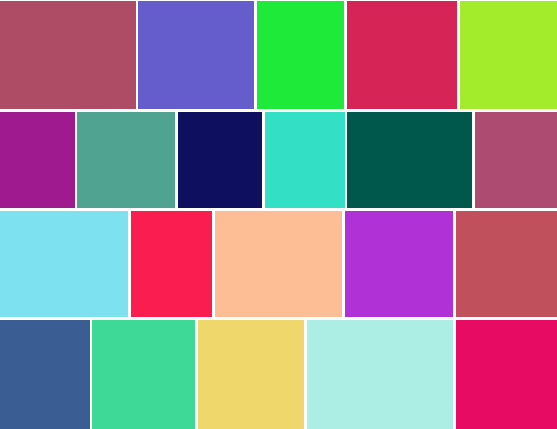

[](https://badge.fury.io/js/%40kurpachsv%2Freact-gallery)
[](https://travis-ci.org/kurpachsv/react-gallery)
[](https://coveralls.io/github/kurpachsv/react-gallery?branch=master)
[](https://codeclimate.com/github/kurpachsv/react-gallery/maintainability)

# react-gallery

A simple, fast and flexibility images gallery.

## Preview



See [storybook](https://kurpachsv.github.io/react-gallery/?selectedKind=Examples&selectedStory=Basic%20Example&full=0&addons=1&stories=1&panelRight=0) for live demonstration.

## Usage

`npm i --save @kurpachsv/react-gallery`

```
import {Gallery} from '@kurpachsv/react-gallery';
```

```javascript
const imageRenderer = image => {
    return (
        <Fragment>
            
            <div
                style={{
                    paddingTop: `${image.placeholderHeight}%`,
                }}
            />
        </Fragment>
    );
};
```

```javascript
class Example extends Component {
    render() {
        return (
            <Gallery
                imageRenderer={imageRenderer}
                images={
                    // ...
                }
            />
        );
    }
}
```

For more details see [examples](https://github.com/kurpachsv/react-gallery/blob/master/examples/src/Examples.js).

## License

MIT, Copyright (c) 2018, Sergei Kurpach